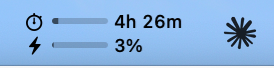
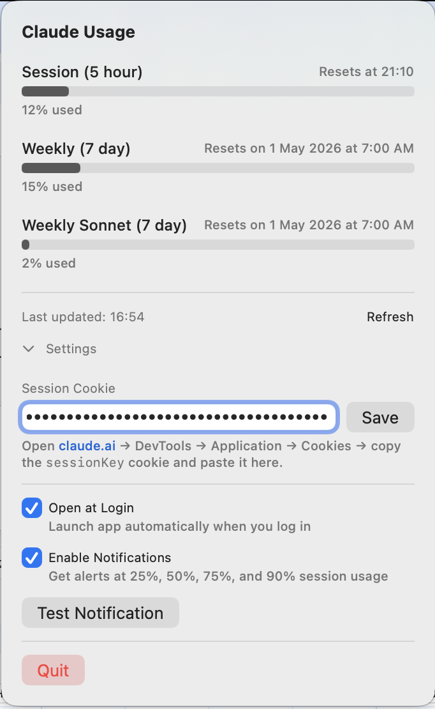

# Claude Usage Bar

A tiny macOS menu bar app that shows your Claude.ai usage at a glance: 5-hour session, weekly, and Sonnet weekly limits.






## Features

- Two compact bars in the menu bar: time left in the 5-hour session and current session usage %, each with its own icon and label
- Adapts to light and dark menu bar appearances automatically
- Click for a popover with all usage windows (5-hour session, 7-day weekly, 7-day Sonnet weekly) and exact reset times
- Popover bars turn orange at 70% and red at 90%
- Background refresh every ~15 min (with jitter), plus refresh on wake and when the popover is opened
- Optional notifications at 25% / 50% / 75% / 90% session usage
- Open at login

## Install

Requires macOS with the Swift toolchain (Xcode command line tools). Install them once with `xcode-select --install` if you don't have them.

```sh
git clone git@github.com:jesusalber1/claude-usage-bar.git
cd claude-usage-bar
./install.sh
```

`install.sh` builds the app, copies it to `/Applications`, and launches it. Re-run it any time to upgrade.

## Setup

The app needs your Claude.ai session cookie to read your usage from the same private endpoint the website uses.

1. Open [claude.ai](https://claude.ai) in your browser, signed in.
2. Open DevTools → Application → Cookies → `https://claude.ai`.
3. Copy the value of the `sessionKey` cookie (the long token starting with `sk-ant-…`).
4. Click the menu bar icon → Settings → paste it into the cookie field and hit **Save**.

Your cookie is stored locally in `UserDefaults` and is only sent to `claude.ai`.

## Open at Login

To have Claude Usage Bar launch automatically when you sign in, click the menu bar icon → Settings and toggle **Open at Login**. This uses macOS's `SMAppService`, so you can also manage it from System Settings → General → Login Items.

## Privacy

This app talks to `claude.ai` and nothing else. No telemetry, no analytics, no third-party servers.

## License

MIT
